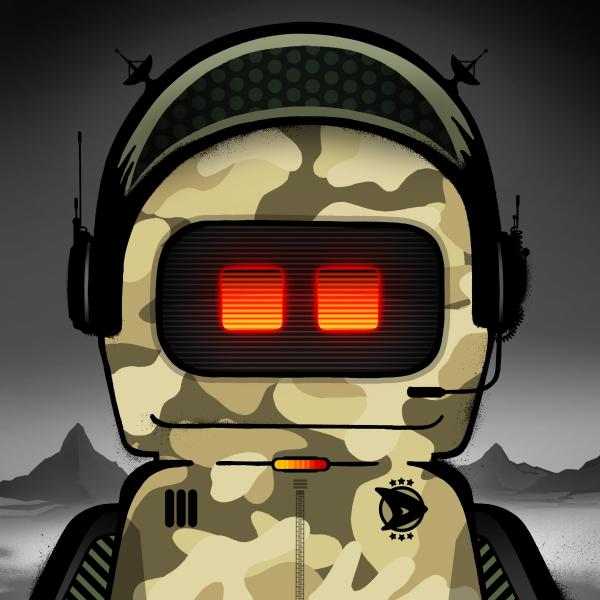

# What is DOJICREW?

[DOJICREW](https://dojicrew.com/#about) is a spray-based generative NFT project created by [Ame72](https://www.ame72.com) with the [RUG team](https://rug.tech). 

DOJIs are randomly generated with different parts, each parts coming from a real-life sprayed piece which was scanned and converted as a digital image. The real-life spraying leads to some overspray of the DOJI's outline, enforcing the authenticity of the art.

.png>)
